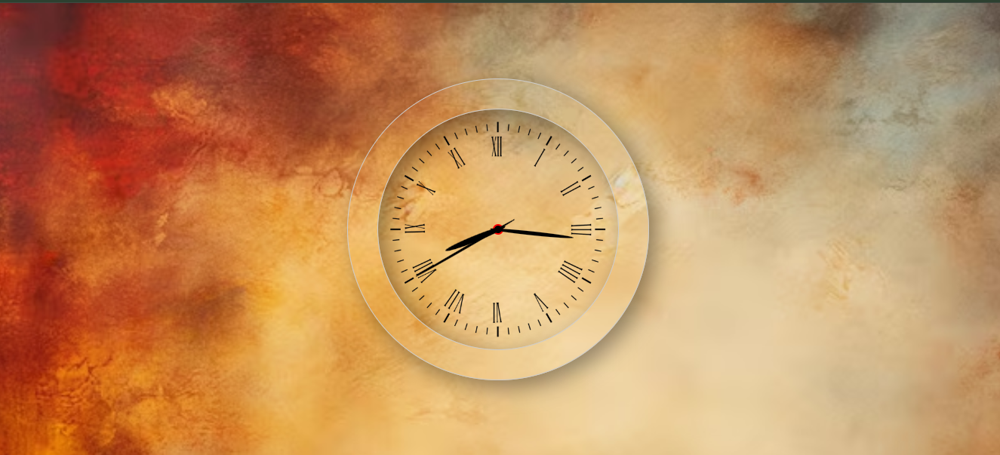

# Dynamic Clock | JavaScript Projects

This project demonstrates how to create a simple dynamic clock using **HTML**, **CSS**, and **JavaScript**. The clock dynamically updates to show the current hour, minute, and second, with a rotating clock hand animation.

## Table of Contents

- [Dynamic Clock | JavaScript Projects](#dynamic-clock--javascript-projects)
  - [Table of Contents](#table-of-contents)
  - [Demo](#demo)
  - [Features](#features)
  - [Technologies Used](#technologies-used)
  - [Setup Instructions](#setup-instructions)
  - [Code Explanation](#code-explanation)
    - [Key JavaScript Logic:](#key-javascript-logic)
  - [Screenshots](#screenshots)
  - [License](#license)

---

## Demo

Check out the [live demo](https://ajay-dhangar.github.io/dynamic-clock/) of this project.

## Features

- Dynamic clock with live updates
- Clock hands for hours, minutes, and seconds
- Background image and shadow effects for a polished design
- Real-time movement of clock hands based on the current time

## Technologies Used

- **HTML5**: Structure of the page
- **CSS3**: Styling the clock and animations
- **JavaScript**: Time management and clock hand rotation

## Setup Instructions

To run this project locally:

1. Clone the repository:
    ```bash
    git clone https://github.com/your-username/dynamic-clock.git
    ```
2. Open the project folder:
    ```bash
    cd dynamic-clock
    ```
3. Open `index.html` in your browser to see the dynamic clock in action.

Alternatively, if you'd like to host the project:

1. Use a live server (like VS Code extension **Live Server**) to serve the files.
2. Open your browser and navigate to the server URL.

## Code Explanation

- **HTML**: Basic structure for the clock, including `div` elements for the clock container, hour, minute, and second hands.
- **CSS**: Styling for the clock's size, shape, and rotation effects. The clock hands are styled using `::before` pseudo-elements to define their length and position.
- **JavaScript**: 
    - JavaScript `Date` object is used to fetch the current time.
    - The clock hands rotate based on the calculated angles for hours, minutes, and seconds.
    - `setInterval()` ensures the clock updates every second.

### Key JavaScript Logic:
```js
setInterval(() => {
  let date = new Date();

  hr = date.getHours() * 30;   // Each hour moves the hour hand by 30 degrees
  min = date.getMinutes() * 6; // Each minute moves the minute hand by 6 degrees
  sec = date.getSeconds() * 6; // Each second moves the second hand by 6 degrees

  hrEle.style.transform = `rotateZ(${hr + min / 12}deg)`; // Additional rotation for hour hand based on minutes
  minEle.style.transform = `rotateZ(${min}deg)`;          // Rotate minute hand
  secEle.style.transform = `rotateZ(${sec}deg)`;          // Rotate second hand
});
```

## Screenshots



## License

This project is licensed under the MIT License - see the [LICENSE](./LICENSE) file for details.